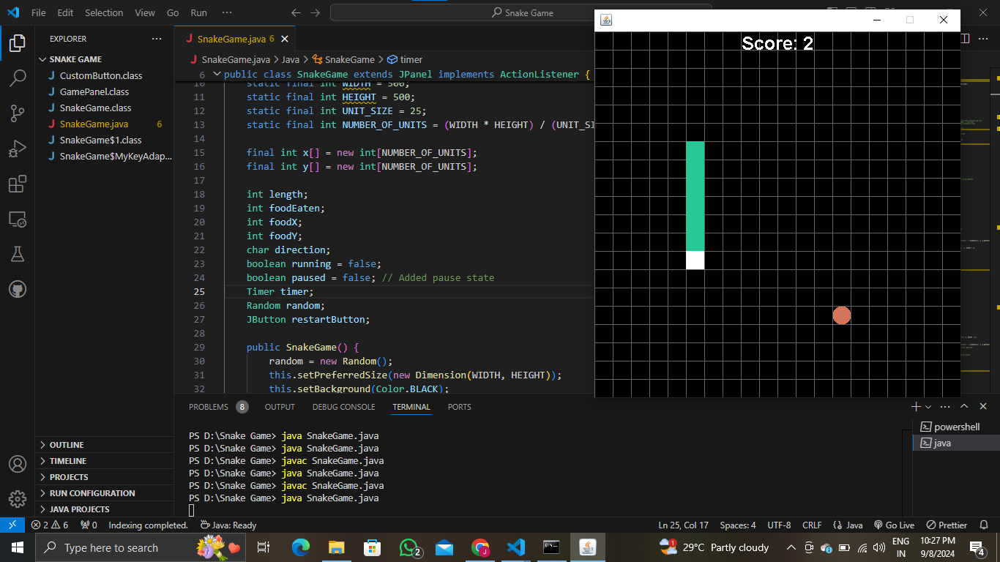

# Snake Game 🐍🎮

An interactive Snake game built using Java Swing. Navigate the snake, eat the food, and avoid collisions in this classic arcade game, now with custom graphics and a restart feature.

## Features

- **Snake Movement**: Control the snake with arrow keys (Up, Down, Left, Right).
- **Pause/Resume**: Pause the game by pressing the space bar.
- **Grid Layout**: Snake and food are aligned on a grid for precise movement.
- **Custom Design**: Snake head, body, and food are uniquely colored.
- **Score Display**: Tracks the score based on how much food the snake eats.
- **Game Over Screen**: A distinct game-over screen with a restart button.

## How to Play

1. **Start the Game**: Launch the application to start playing.
2. **Control the Snake**: Use the arrow keys to navigate the snake.
3. **Eat the Food**: The snake grows longer when it eats food.
4. **Avoid Collisions**: Don't run into the walls or the snake's own body.
5. **Pause/Resume**: Press the space bar to pause or resume the game.
6. **Restart**: When the game ends, click the **Restart** button to play again.

## Controls

- **Arrow Keys**: Move the snake (Up, Down, Left, Right)
- **Space Bar**: Pause/Resume the game

## Screenshots

.

## How to Run

1. **Compile the Program**:

    ```bash
    javac SnakeGame.java
    ```

2. **Run the Program**:

    ```bash
    java SnakeGame
    ```

## Custom Components

- **CustomButton**: A custom `JButton` for the restart feature, styled with unique colors and no border.
- **Snake Graphics**: Custom snake head and body, with different colors for better visualization.
- **Grid Drawing**: The game includes a grid to show the movement area.

## Dependencies

- Java (JDK 8 or later)

## Contributing

Feel free to fork this repository, create a feature branch, and submit a pull request. Contributions are welcome!
